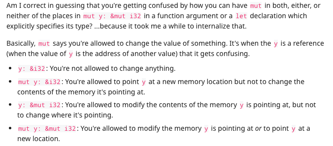

rust-learning

为什么 let mut gues = String::new()

还能 &mut guess




下边两篇帖子中摘录的 mutable variable 和 const 的区别

https://laurieontech.com/posts/rust-mut/

## In Rust, you define a variable like so:

```rust
let x = 2;
```

By default, `x` is immutable, or **read only**. That's perhaps a bit confusing for those coming from JavaScript because it's the opposite. 不可变变量当做只读，可变变量是可读可写，大概先这样理解

https://www.christopherbiscardi.com/variables-in-rust#constants

## Constants

Rust also has Constants, which live for the lifecycle of the entire program and are unchangeable. This makes then useful for values that don't change, like the speed of light or the number of squares on the tic-tac-toe board. const可以当做一个全局的宏的感觉

Constants must have types.

```rust
const THRESHOLD: i32 = 10;


fn main() {
  println!("the threshold is {}", THRESHOLD);
}
```


## You might already be familiar with this concept, and wonder:

> If variables are immutable by default, what’s the difference between variables and constants?
>
> you

- You aren’t allowed to use `mut` on constants. No mutating, ever.
- The type of a constant *must* be declared, whereas the type of a variable *may* be declared.
- Constants can only be set to a constant [expression](https://nickymeuleman.netlify.app/garden/rust-expression-statement), not to the result of a function call or anything that could only be determined at runtime.

As a result, constants are always fixed in size, and known at compile time.
Another, less obvious result, is that constants may not be of a type that requires [allocation on the heap](https://nickymeuleman.netlify.app/garden/rust-stack-heap), since they’re not known at compile time.

- The naming convention for `const` is `SCREAMING_SNAKE_CASE`.
- The naming convention for `let` is `snake_case`.

```rust
COPY
const SPEED_OF_LIGHT: u32 = 299792458;
```

Constants can be declared in any scope, including the global scope.
They are valid for the entire runtime of the program inside that scope.
Translation: You can put constants outside of the `main` function and it will work.

